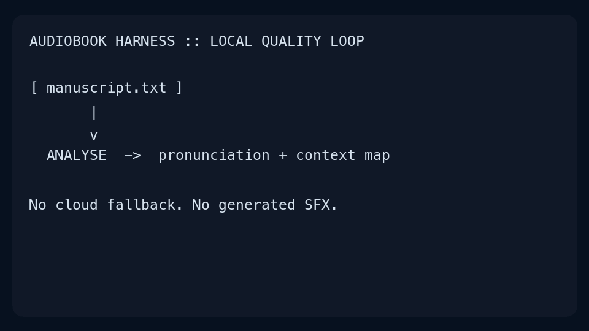

# Audiobook Harness

A local-first, evidence-based audiobook production harness for coding agents.
It focuses on manuscript analysis, pronunciation control, contextual dialogue,
Kokoro TTS, independent local speech verification, forced alignment, and reproducible
M4A/MP3 delivery with staged promotion.

Reviewed decoder-spelling equivalences are supported for protected names and
phrases, but only as local transcript-comparison evidence. They never change the
manuscript or spoken input; see the [quality contract](docs/QUALITY.md).

It does **not** bundle manuscripts, cloned voices, music, SFX, synthetic sound
generation, or cloud APIs.



The animation is a local ASCII-style production walkthrough. It mirrors the
eight chapter stages shown by `audiobook-harness status`, from analysis through
staging and the final series audit. It shows the release contract, not a
benchmark: actual time depends on manuscript length, reviewed vocabulary,
hardware, and the number of rejected takes. See the [production walkthrough](docs/PRODUCTION_WALKTHROUGH.md) for the corresponding stage contract.

## Quick start

```bash
python scripts/setup.py --interactive
.venv/bin/audiobook-harness doctor
.venv/bin/audiobook-harness new-project projects/my-book
# place your licensed manuscript text at projects/my-book/source/chapter-01.txt
.venv/bin/audiobook-harness analyze projects/my-book
.venv/bin/audiobook-harness generate projects/my-book
.venv/bin/audiobook-harness verify projects/my-book
.venv/bin/audiobook-harness stage projects/my-book
.venv/bin/audiobook-harness status projects/my-book --watch
.venv/bin/audiobook-harness promote projects/my-book
```

On Windows, use `.venv\\Scripts\\audiobook-harness.exe` instead.

Start with the plain-language [first-book guide](docs/GETTING_STARTED.md), then
read [setup](docs/SETUP.md), the [quality contract](docs/QUALITY.md),
[performance planning](docs/PERFORMANCE.md), [workflow architecture](docs/ARCHITECTURE.md), and the agent
[skill](skills/audiobook-harness/SKILL.md). A local, model-free Linux onboarding check is documented in
[Container smoke test](docs/SETUP.md#container-smoke-test).

## Verify this checkout

Run the repository checks before starting a book:

```bash
scripts/test-harness.sh
```

It runs the unit tests and linting with the local virtual environment. If the
already-built local smoke image is present, it also runs its model-free offline
container check; it never pulls an image or downloads a model.
