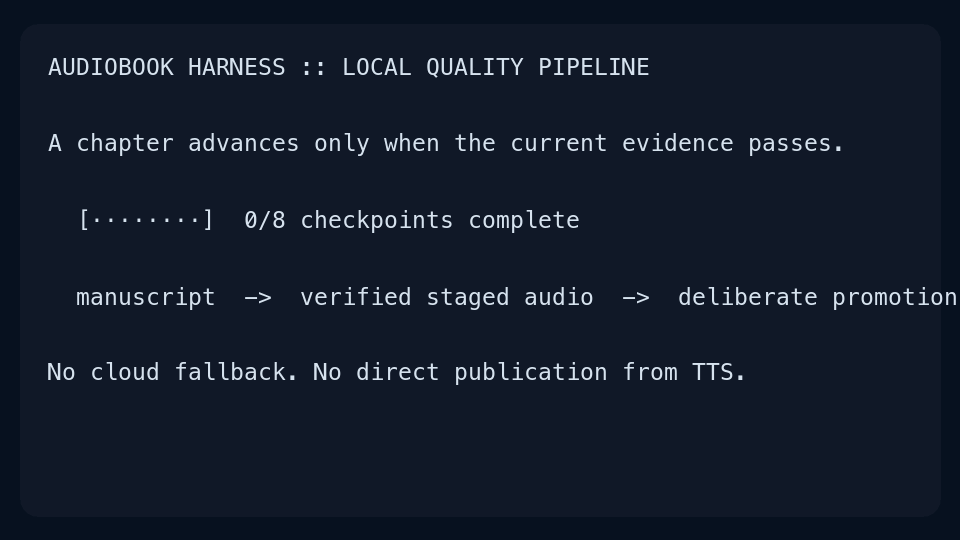
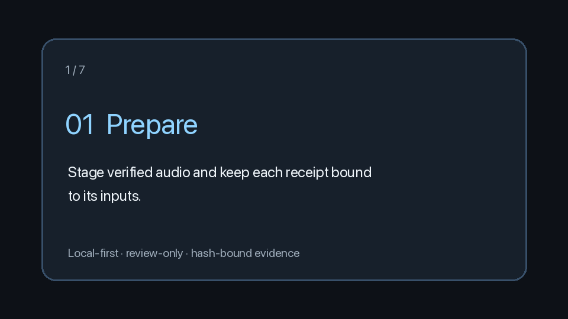

# Audiobook Harness

Current release: **0.5.6**. Audiobook Harness uses one SemVer product identity;
project names and profile hashes do not create a second harness version. See
[versioning and compatibility](docs/VERSIONING.md).

## Maturity and support boundary

This release targets controlled, maintainer-operated local production. The
deterministic core is testable from a clean checkout, but unattended
multi-user operation, stable public Python API compatibility, and third-party
operational support are not yet guarantees. Review, staging, and promotion
remain explicit boundaries.

The hash-bound outstanding-work model separates automatic repair, current
verification, cross-episode dependencies, focused listener review, completion,
and fatal implementation faults. Automatic work always precedes review.

A local-first, evidence-based audiobook production harness for coding agents.
It focuses on manuscript analysis, pronunciation control, contextual dialogue,
Kokoro TTS, dual-checkpoint local Whisper verification, forced alignment, and reproducible
M4A/MP3 delivery with staged promotion.

Version 0.5.6 executes all eight phases as receipt-last transactions. Each
phase has its own dependency identity, success predicates, retry policy, and
structured result. A small harness or review-server change therefore cannot
invalidate unrelated audio work. Failed implementation attempts roll back
partial owned outputs; quality failures retain their evidence without creating
a success receipt.

Repair tickets are bound to both evidence and harness implementation identity.
An exhausted repair is not repeated unchanged, but a tested harness correction
can reopen it once with a fresh bounded budget. Reviewed phoneme replacements
are idempotent: a correction already present in the current pronunciation plan
continues to synthesis instead of failing because its obsolete source span is
gone.

Post-generation failures now produce `repair-diagnosis.json` and
`repair-plan.json`. The diagnosis fuses dual-ASR, acoustic, duration, and
book-local pace evidence before choosing a bounded strategy; it no longer
treats every failed cue as another generic speed retry. Optional precomputed
CTC, NISQA, UTMOS, or speaker-similarity results are collected in
`advisory-quality.json`, but remain ranking and review-priority signals only.
They never approve a take or trigger a model download. Finalized listening
decisions append compact repair outcomes so accepted strategies can be ranked
for similar future defects without silently changing quality thresholds.

Candidate exhaustion is strategy-aware. One slot is reserved for each declared
repair family, and a full numeric budget cannot conceal an untried contextual,
pronunciation, spoken-form, or semantic strategy. `effective-cue-state.json`
reconciles candidate, pronunciation, duration, pause, energy, and expressive
evidence before a selected waveform becomes final. A downstream rejection
therefore leaves that selection provisional and names one owning repair phase.

An optional span-local duration adapter can create a review candidate for a
mild, MFA-bounded overhold of at most 12 percent. It never changes prominent
words, never approves its own output, and falls back to contextual resynthesis
for larger corrections. The adapter uses an explicitly installed and
fingerprinted `rubberband` executable; the harness does not download or bundle
it.

Pronunciation overrides are now located on phoneme-token boundaries and are
preflighted in several sentence positions before synthesis. Contextual G2P
variation can become a term-local diagnostic instead of an unstructured render
crash, while the reviewed IPA remains the only pronunciation authority.

Reviewed decoder-spelling equivalences are supported for protected names and
phrases, but only as local transcript-comparison evidence. They never change the
manuscript or spoken input; see the [quality contract](docs/QUALITY.md).

It does **not** bundle manuscripts, cloned voices, music, SFX, synthetic sound
generation, or cloud APIs.



The animation is a local ASCII-style production walkthrough. It illustrates eight quality checkpoints. The command-line status view intentionally groups them into five clear milestones: analyse, generate, verify, stage and promote. It shows a release contract, not a benchmark: actual time depends on manuscript length, reviewed vocabulary, hardware and rejected takes. See the [production walkthrough](docs/PRODUCTION_WALKTHROUGH.md) for both a plain-language and expert view.

## Progress you can trust

Every production command writes `production/run-status.json` and the matching
human-readable `production/progress.md`. `status --watch` displays the same
file with a progress bar and current stage; it does not guess from output files.
The view records its own update timestamp and the PID of the command that wrote
the active state. If that command no longer exists, the harness labels the
snapshot **interrupted** rather than pretending work is still running. A failed
or completed run is explicitly labelled historical. This makes it safe to
monitor a long operation from a second terminal without confusing an old render
of the progress file for a live job.

During dual-ASR verification, `production/asr-progress.json` records the
completed candidate count, active checkpoint, cache hits, and last completed
file. This is advisory progress only; transcripts, hashes, alignment, and the
verification report remain the release evidence.

`produce` runs analysis, candidate generation, dual-ASR and MFA verification,
one bounded failed-unit repair, and staging as one monitored command. It never
promotes files automatically. If the same failed units recur with the same
manuscript, lexicon, configuration and harness code, an input-bound recovery
ledger prevents the next run from spending the same retry again. Changed inputs
receive a new identity and can be tried normally.

## Structural audit

The repository includes a local CodeGraph/Sentrux audit for architecture
changes. Initialize CodeGraph once, then run:

```bash
codegraph init .
scripts/audit-structure.sh
```

The audit is local engineering feedback only. It excludes publication
authority, audio decisions, model setup, and cloud services.

## Quick start

```bash
python scripts/setup.py --interactive
.venv/bin/audiobook-harness doctor
.venv/bin/audiobook-harness performance --profile auto
.venv/bin/audiobook-harness new-project projects/my-book
# place your licensed manuscript text at projects/my-book/source/chapter-01.txt
.venv/bin/audiobook-harness produce projects/my-book --performance-profile auto
.venv/bin/audiobook-harness status projects/my-book --watch
# listen to the staged files and inspect production/verification.json
.venv/bin/audiobook-harness promote projects/my-book
```

After an interruption, inspect the exact reuse plan and continue from the first
invalid phase:

```bash
.venv/bin/audiobook-harness produce projects/my-book --resume --dry-run
.venv/bin/audiobook-harness produce projects/my-book --resume --performance-profile auto
```

Verified earlier phases and matching input-addressed, waveform-hashed audio are retained.
Repaired units keep immutable chapter and manuscript sequence fields, and
packaging rejects missing, duplicate, or discontinuous selections rather than
silently moving repaired audio to a chapter's end. Reviewed pronunciation
overrides are occurrence-aware, including reviewed aliases, and the configured
`outputs` list controls which FLAC, M4A, or MP3 files are staged.

On Windows, use `.venv\\Scripts\\audiobook-harness.exe` instead.

## Choose your depth

**First audiobook:** follow the plain-language [first-book guide](docs/GETTING_STARTED.md), then
read [setup](docs/SETUP.md), the [quality contract](docs/QUALITY.md),
[performance planning](docs/PERFORMANCE.md), [workflow architecture](docs/ARCHITECTURE.md), and the agent
[skill](skills/audiobook-harness/SKILL.md). A local, model-free Linux onboarding check is documented in
[Container smoke test](docs/SETUP.md#container-smoke-test).

`performance --profile auto` displays a conservative local CPU budget. Pass
`--performance-profile auto` to `verify` or `produce` to use it for forced alignment. If a
parallel alignment worker fails for a recognised transient runtime reason, the
same work restarts once in a clean serial runtime; dictionary, corpus, semantic
and quality failures remain blocking. It never weakens the quality contract or
turns GPU/NPU use into release evidence.

If you prefer explicit control, run `analyze`, `generate`, `verify`, `stage`,
and `promote` separately. `retry` adds bounded candidates only for units listed
as failed by the current verification report.

## Verify this checkout

The canonical reproducible development install uses the committed `uv.lock`:

```bash
uv sync --frozen --extra dev
```

The existing `.venv` setup remains supported for operators who use the
documented setup script.

Run the repository checks before starting a book:

```bash
scripts/test-harness.sh
```

It runs the unit tests and linting with the local virtual environment. For a
machine-readable report (including optional formatting status), run
`.venv/bin/python scripts/verify-harness.py --profile release --report production/verification-report.json`.
For a focused maintenance check, choose one of `integrity`, `filesystem`,
`quality`, `supply-chain`, or `operations`; see
[`docs/ISSUE_CLOSURE.md`](docs/ISSUE_CLOSURE.md) for the acceptance boundary of
each profile.
If the
already-built local smoke image is present, it also runs its model-free offline
container check; it never pulls an image or downloads a model.

`produce --max-candidate-retries N` uses an evidence-bounded convergence ladder
(0–8 iterations). It reuses valid phase receipts, records
`production/convergence-iterations.jsonl`, and stops with a focused review when
the next repair is subjective or when the evidence fingerprint plateaus. It
never treats an acoustic score as listener approval.

Production uses a project-local single-writer lock. A second command against
the same project fails clearly while the owner is active; an orphaned lock is
recovered only when its recorded process no longer exists.

See [filesystem and concurrency safety](docs/FILESYSTEM_SAFETY.md) before
placing a production project on a network, synchronized, or symbolic-link path.

## Review Center

Audiobook Harness keeps the existing single-project review command and adds a
local multi-project Review Center. The Review Center is review-only: it never
publishes audio and never turns a draft into authority without an explicit
finalization.

Create a workspace configuration such as `review-center.json`:

```json
{
  "version": 1,
  "default_project": "my-book",
  "projects": [
    {"id": "my-book", "path": "projects/my-book", "display_name": "My Book"}
  ]
}
```

Start and monitor the single loopback server:

```bash
scripts/review-center start --workspace-root . --config review-center.json
scripts/review-center status --workspace-root . --config review-center.json
# open http://127.0.0.1:8765/review-center/
scripts/review-center stop --workspace-root . --config review-center.json
```

The same workflow is available cross-platform through the CLI:

```bash
audiobook-harness review-center start --workspace-root . --config review-center.json
audiobook-harness review-center restart --workspace-root . --config review-center.json
```

The chooser opens `/review-center/<project-id>/`. Each project has isolated
media, draft, status, and finalize routes. The server is loopback-only and
stores its PID and log in the platform temporary directory. Existing
`audiobook-harness review PROJECT` usage remains supported.

Recommended production workflow:

```text
produce → inspect staged evidence → Review Center → Finalize review
        → compile feedback → bounded resume/repair → promote
```

See [Review Center documentation](docs/REVIEW_CENTER.md) for configuration,
route safety, troubleshooting, and migration details.



GitHub can display the GIF above, but it intentionally does not execute
JavaScript from repository HTML files. To use the interactive walkthrough
locally, run:

```bash
cd docs/assets
python3 -m http.server 8000
# open http://127.0.0.1:8000/review-center-workflow.html
```

See [the local interactive walkthrough instructions](docs/assets/README.md).

## v0.5 review gate

Version 0.5.6 writes source-preserving analysis contracts for structure, spoken
forms, dialogue, prosody and TTS risk. After staging, run
`audiobook-harness review PROJECT`; the loopback service saves review drafts
directly under `production/`. Finalize decisions in the panel or with
`audiobook-harness finalize-review PROJECT decisions.json`; finalization also
refreshes the compiled feedback summary. Rejections become queued, traceable
correction observations, not automatic global defaults. Promoting a learned rule requires
a verified correction, follow-up listening approval, clean regression evidence,
and the documented repetition or editorial-authority threshold. Existing
projects can inspect an upgrade with `audiobook-harness upgrade-project
PROJECT`; applying it requires the reported inventory hash.

Version 0.5.6 also exposes the production contract directly:

```bash
audiobook-harness pipeline-audit PROJECT
audiobook-harness quality-measurements PROJECT
audiobook-harness feature-parity PROJECT
```

The parity report is evidence-based. A capability is passing only when its
required, current artifact exists. It does not turn a declared project feature
or an old receipt into proof of current quality.

`produce --resume --dry-run` and execution now share the same eight-phase
planner. A phase-scoped repair may preserve earlier hash-valid work, but the
owning phase and every downstream phase must rerun. The loopback review server
uses one port for media, current status, autosave, and finalization, and disables
controls whenever the review identity is stale.

Encoded-deliverable QA treats the authored PCM chapter tail as authoritative.
AAC and MP3 timing may differ by at most one codec frame; larger drift or a
missing tail measurement blocks staging without invalidating narration.

Candidate retries are additive rather than destructive. The harness retains
hash-valid candidates, adds only untried unique alternatives within the
analysis-defined budget, and records the result in
`production/candidate-strategy-ledger.json`.
